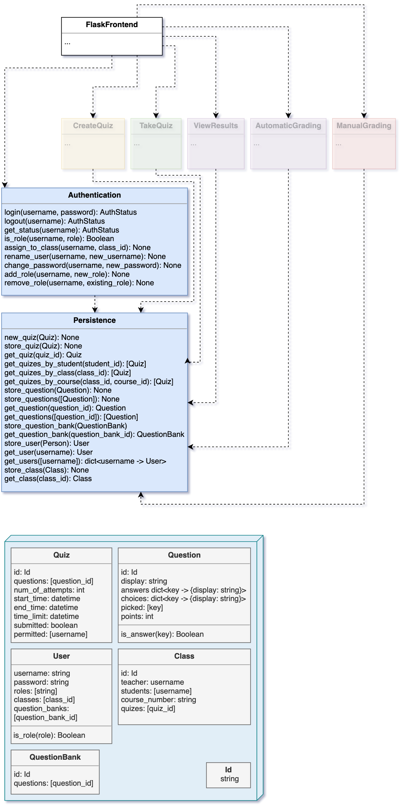

% 2005 - Assignment #5 - Description
% Jack Arthur Harrhy - 201732922

Since the assignment has been assigned our group has met together multiple times to discuss the structure of different objects/methods we want our classes to have.

Olmstead, Kyle (kolmstead@mun.ca)
Huang, Xiaochuan (xh6634@mun.ca)
Shevchenko, Arsenii (ashevchenko@mun.ca)
Langer, Aidan (aplanger@mun.ca)
Harrhy, Jack (jaharrhy@mun.ca)

# Programming Component & Module Design

## Authentication

The authentication system built into our quiz application will allow for the creation of users, both student and instructor.  Defined in the high-level diagram for this application is a selection of data strucutres shared throughout the different modules within the project is simply a 'User' object, the role of the user being an list of roles, permitting for a user in the future to have more than one role.  In our case however a user will only either have a role of following:

```python
from structures import User

a = User(...)
a.roles # -> ["student"]

b = User(...)
b.roles # -> ["professor"]

c = User(...)
c.roles # -> ["guest"]
```

'C' is to abide by the requirement to have users "who are guests or not formally registered for the course.".

Since the function of creating a user is delegated to my module, I will define each property of a user, and how it relates to the functional requirements.

+ Username:

> + What a user will use to login/identify themselves with.
>
> + Unique, there cannot be two Users with the same Username; the creation of a user will verify this restriction.

+ Password:

> + Will be hashed at creation, and hashed at any future update, therefore a raw password will never reach the persistence class.
>
> + Will have the potential for password requirements if the client requests, such as minimum length/character usage.

+ Roles:

> + Covered in example above.

+ Classes:

> + List of classes that the user has been enrolled in.

+ Question Banks:

> + Question Banks created by and for the usage of professors; therefore empty for regular users.

## Persistence

Creating the methods for persistence required collecting what each of my coworkers wanted their modules to have access to; the interface is much more than a generic object/list/etc. data storage.

Since each item has some unique key, rather that be a id/username/etc, the items can be pulled from the data storage using these IDs.

This is useful, since by starting at a users username, all information about what classes they are in/what quizes they can create/question banks can be pulled from that.

```python
from structures import Quiz

q = Quiz(...)

print(q.id) # -> "123abc"

persist.store(Quiz, q)
```

Sometime later, even after a reboot of the application

```python
some_id = "123abc"

q = persist.retrive(Quiz, some_quiz_id)

# we have q again!
```

The diagram below does most of the speaking for what the purpose of the Persistence is; other details are merely implmentation aspects and not important to the higher level concepts at hand.



\pagebreak

# Use Case

## Title: foobar

## Primary Actor: Professor

## Stakeholders and Interests

> + Student: Wants an account to view quizes for a class he is physically enrolled in.
> + Professor: Wants to create account for student, and assign to class.
> + Tech: Does _NOT_ want to have the password for any of the above stakeholders to be stored in the database/logs, but wants all created users to end up stored in the database correctly.

## Precondition

> Professors account exists in the storage.

## Main Scenario

> 1. Professor logs into account with correct credentials
>
> > 1. A) If credentials are incorrect, is not logged in.
>
> 2. Professor navigates to page to create a new user.
>
> 3. Professor creates a new user.
>
> > 3. A) Professor is not permitted to create a user with the username of a user already in storage.

> 4. Professor adds new user to a class.

> 5. Student logs in.
>
> > 5. A) If credentials are incorrect, is not logged in.
>
> 5. Student can view quizes for class he was assigned to by the Professor.
